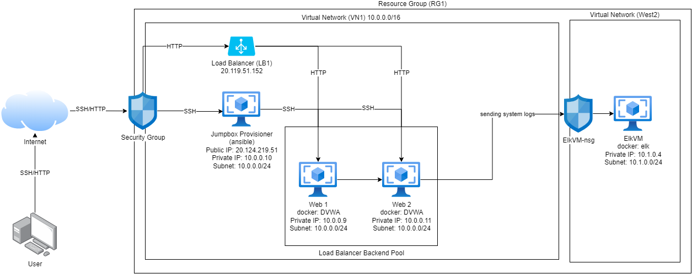

## Automated ELK Stack Deployment

The files in this repository were used to configure the network depicted below.

These files have been tested and used to generate a live ELK deployment on Azure. They can be used to either recreate the entire deployment pictured above. Alternatively, select portions of the YAML file may be used to install only certain pieces of it, such as Filebeat.

  - _Links to all the Playbook files._
  
    - [Initial Playbook](Ansible/pentest.yml)
    - [ELK Playbook](Ansible/elk.yml)
    - [Filebeat Playbook](Ansible/roles/filebeat-playbook.yml)
    - [Metricbeat Playbook](Ansible/roles/metricbeat-playbook.yml)

This document contains the following details:
- Description of the Topology
- Access Policies
- ELK Configuration
  - Beats in Use
  - Machines Being Monitored
- How to Use the Ansible Build

### Description of the Topology

The main purpose of this network is to expose a load-balanced and monitored instance of DVWA, the D*mn Vulnerable Web Application.

Load balancing ensures that the application will be highly accessible, in addition to restricting unauthorized traffic to the network.
- _What aspect of security do load balancers protect? What is the advantage of a jump box?_
  - Load balancers protect against DDoS attacks. The advantage of a jump box is that it's easy to access and the one and only way in to the other internal vms.

Integrating an ELK server allows users to easily monitor the vulnerable VMs for changes to the logs and system metrics.
- _What does Filebeat watch for?_
  - Filebeat looks for changes in files in specific locations and makes sure they are properly indexed.
- _What does Metricbeat record?_
  - Metricbeat records metrics on a chosen server such as CPU or memory, etc.

The configuration details of each machine may be found below.

| Name     | Function | IP Address | Operating System |
|----------|----------|------------|------------------|
| Jump Box | Gateway  | 10.0.0.10   | Linux            |
| Web 1 (DVWA)    | Webserver         | 10.0.0.9           | Linux                 |
| Web 2 (DVWA)    | Webserver         | 10.0.0.11           | Linux                 |
| ElkVM (ELK)    | Elk Stack         | 10.1.0.4           | Linux                 |

### Access Policies

The machines on the internal network are not exposed to the public Internet. 

Only the Jump Box machine can accept connections from the Internet. Access to this machine is only allowed from the following IP addresses:
- _whitelisted IP addresses_
  - The only whitelisted IP address for the Jump Box Provisioner machine is your own personal IP address.

Machines within the network can only be accessed by Jump Box.
- _Which machine did you allow to access your ELK VM? What was its IP address?_
  - The only way to access the ELK VM is through the Jump Box first, then an ansible container.

A summary of the access policies in place can be found in the table below.

| Name     | Publicly Accessible | Allowed IP Addresses |
|----------|---------------------|----------------------|
| Jump Box      | No                    | Admin's set IP        |
| Web 1         | No                    | 20.119.51.152         |
| Web 2         | No                    | 20.119.51.152         |
| ElkVM         | Yes                   | 20.94.216.250         |

### Elk Configuration

Ansible was used to automate configuration of the ELK machine. No configuration was performed manually, which is advantageous because...
- _TODO: What is the main advantage of automating configuration with Ansible?_

The playbook implements the following tasks:
- Make the playbook that installs docker.io, python3-pip, and the docker module
- Increase virtual memory and assign it to the ELK virtual machine
- Make a docker elk container, launch it, and make it able to start on boot.

The following screenshot displays the result of running `docker ps` after successfully configuring the ELK instance.

### Target Machines & Beats
This ELK server is configured to monitor the following machines:
- Machines:
  - Web 1: 10.0.0.9
  - Web 2: 10.0.0.11

We have installed the following Beats on these machines:
- Filebeat 
- Metricbeat

These Beats allow us to collect the following information from each machine:
- `Filebeat` gathers system logs, while `Metricbeat` fetches metrics such as CPU usage or other system services and their uptimes. 

### Using the Playbook
In order to use the playbook, you will need to have an Ansible control node already configured. Assuming you have such a control node provisioned: 

SSH into the control node and follow the steps below:
- Copy the [elk.yml](Ansible/elk.yml) playbook file to Ansible container.
- Update the hosts file to include IP addresses from both webservers and the ELK server as well as the command ansible_python_interpreter=/usr/bin/python3
- Run the playbook, and navigate to kibana web page [http://20.115.152.116:5601/app/kibana] to check that the installation worked as expected.
